# ERP + CRM Operations Portal

A production-quality mini ERP + CRM system for wholesale/distribution companies.

[](https://github.com/rk-005/erp-system/actions)


## 🌐 Live Deployment

| | URL |
|---|---|
| **Frontend** | https://erp-system-coral.vercel.app |
| **Backend API** | https://erp-backend-yazz.onrender.com/api |
| **GitHub** | https://github.com/rk-005/erp-system |

---


## 📸 Screenshots & Workflow

### 🔑 Authentication & Role Dashboards
| Login Page | Admin Dashboard |
|:---:|:---:|
| 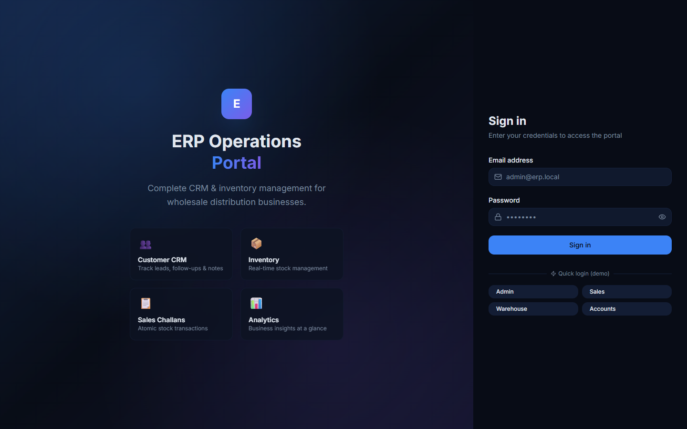 | 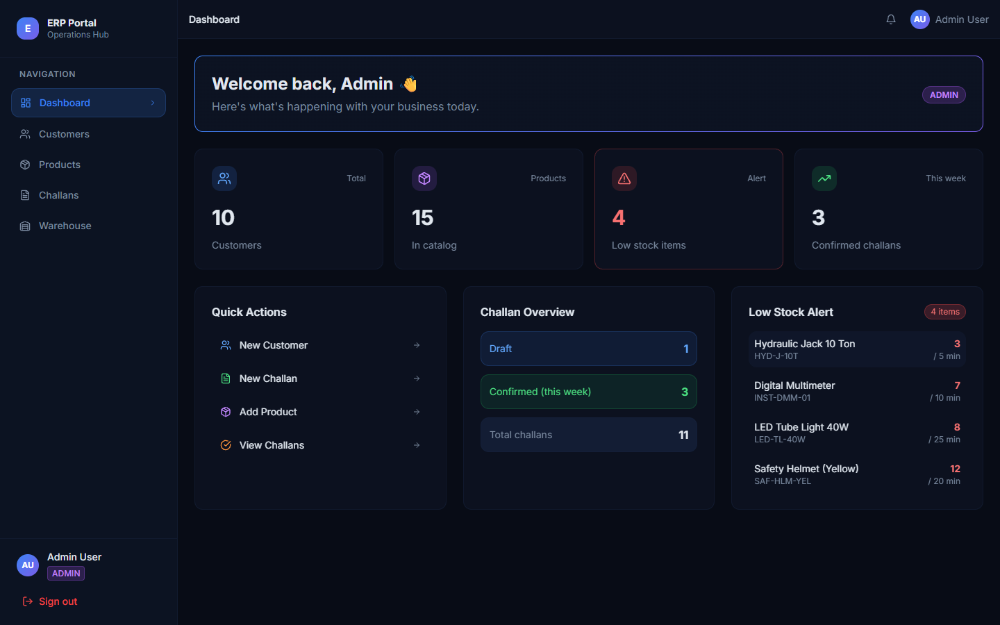 |

| Sales Role View | Accounts Role View |
|:---:|:---:|
| 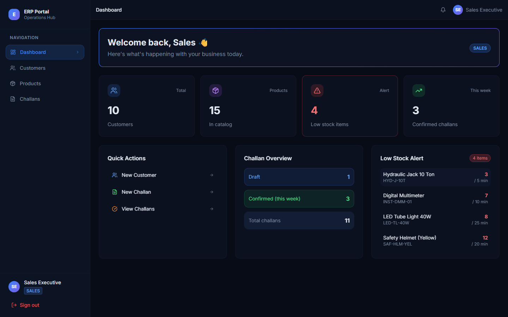 | 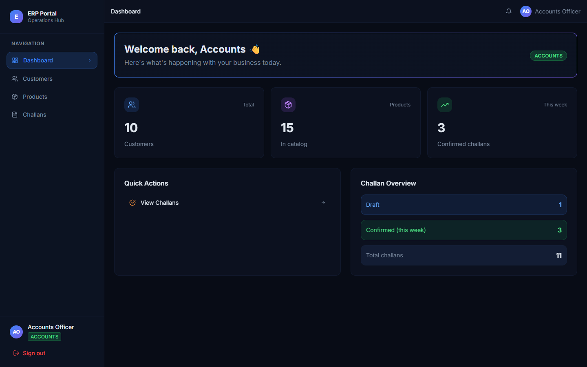 |

### 👥 Customer CRM & 📦 Product Management
| Customers List | Add Customer Modal |
|:---:|:---:|
| 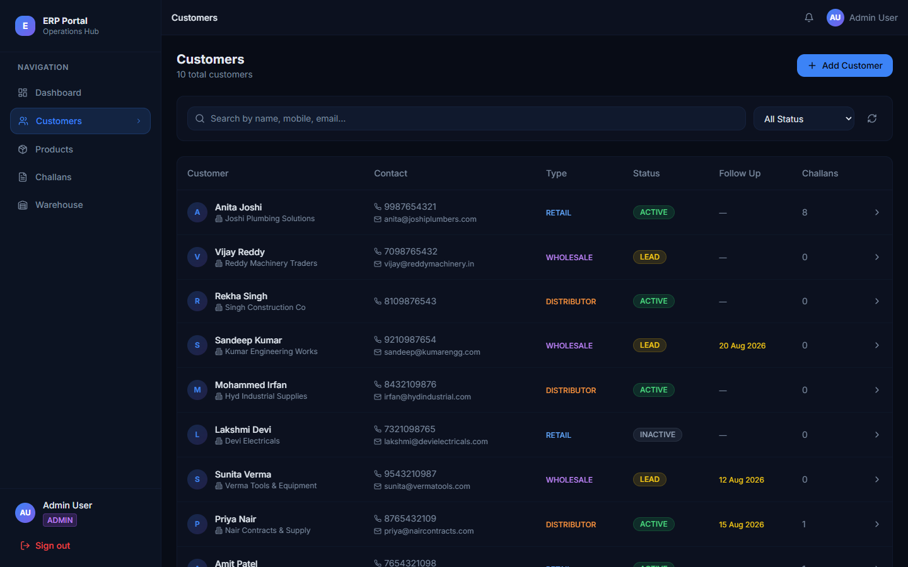 | 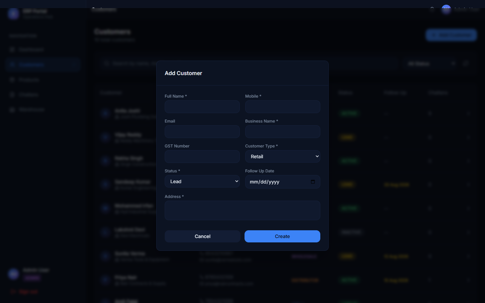 |

| Products List | Add Product Modal |
|:---:|:---:|
| 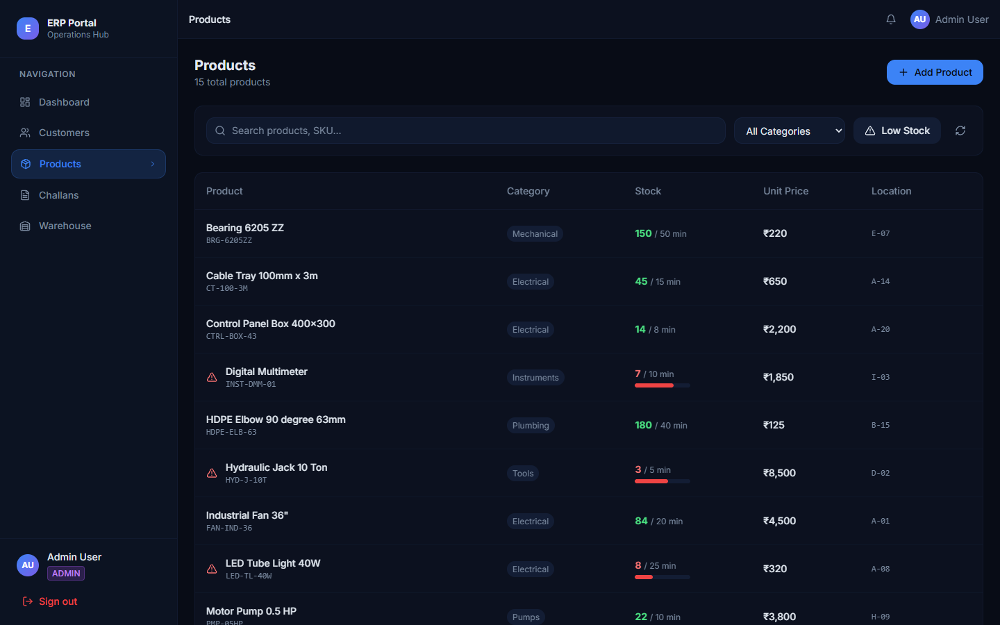 | 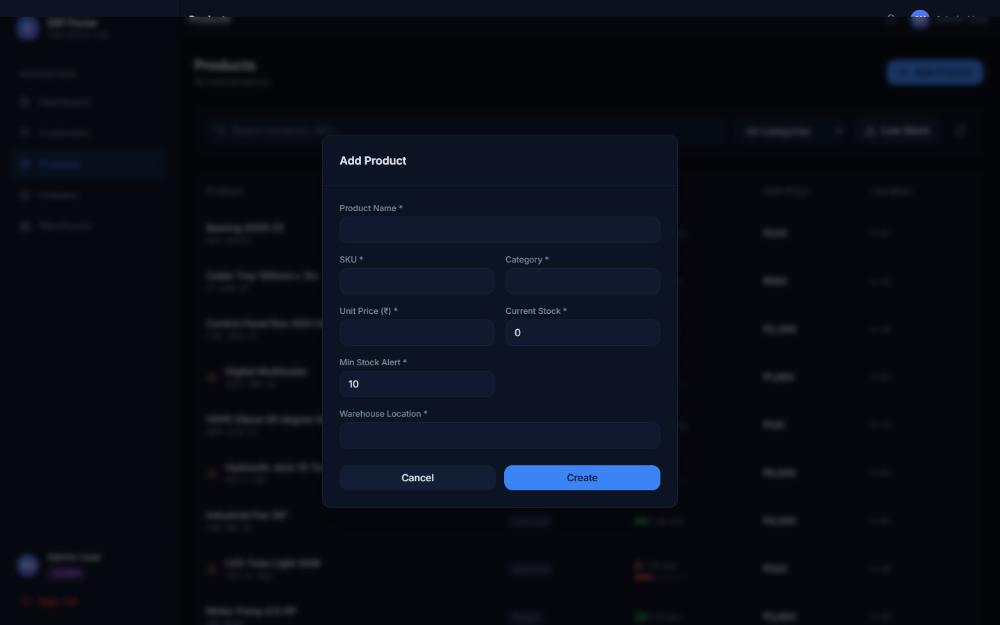 |

### 📋 Sales Challans & PDF Export Workflow
| New Challan Creation | Draft Challan Detail |
|:---:|:---:|
| 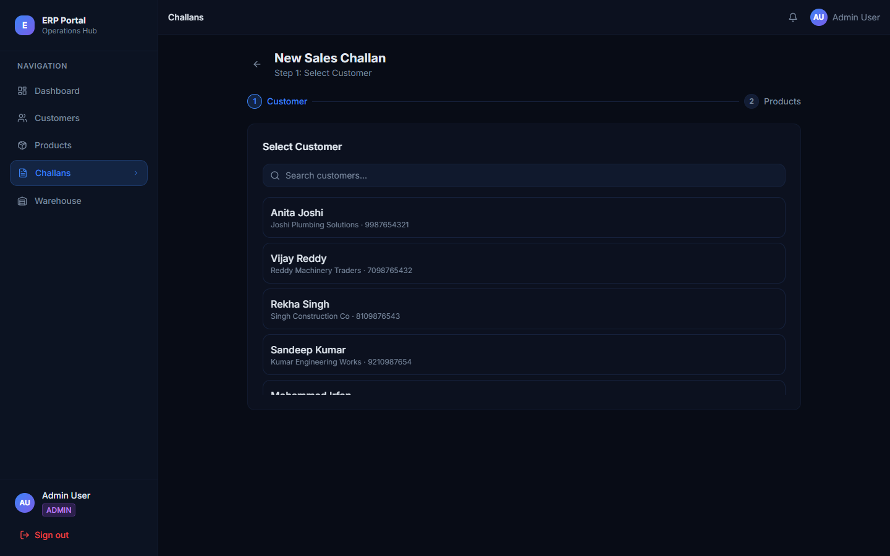 | 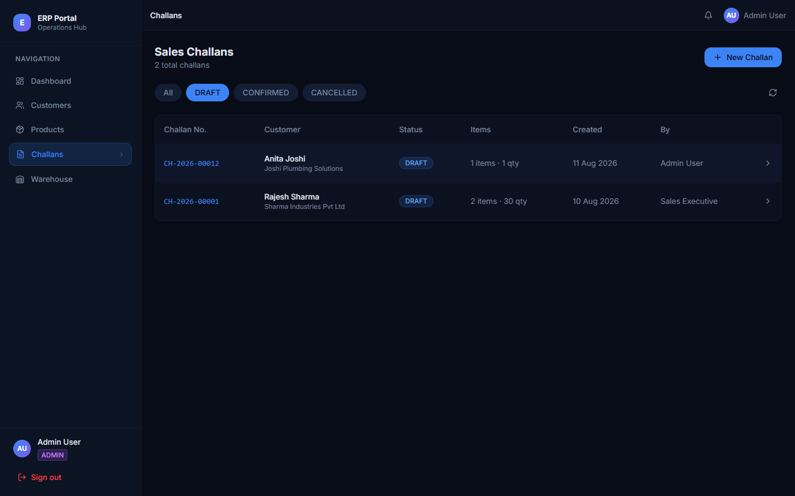 |

| Confirmed Challan (Stock Deducted) | PDF Export & Preview Modal |
|:---:|:---:|
|  | 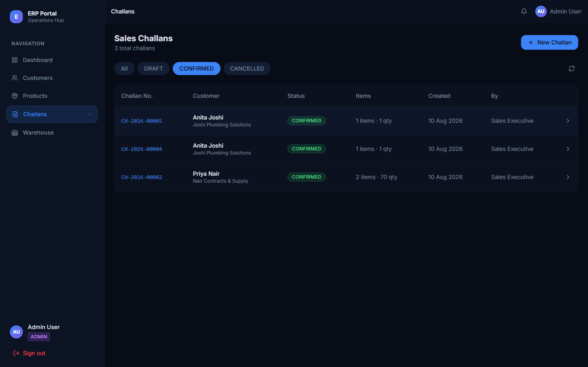 |

| Cancelled Challan (Stock Restored) | |
|:---:|:---:|
| 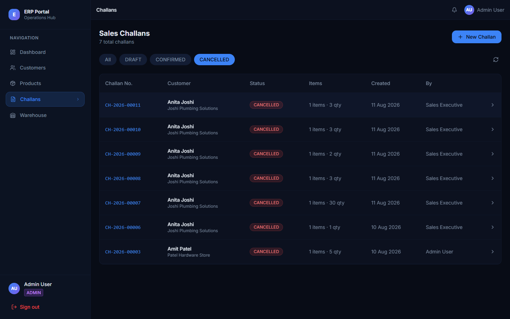 | |

### 📄 Exported PDF Invoices (Confirmed & Cancelled with Watermark)
| Confirmed PDF Invoice | Cancelled PDF Invoice (Watermarked) |
|:---:|:---:|
| 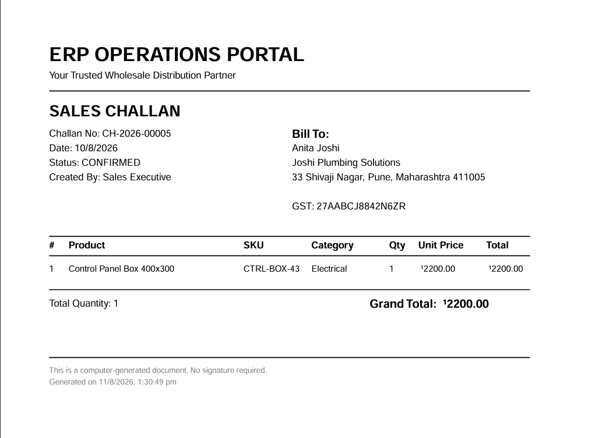 | 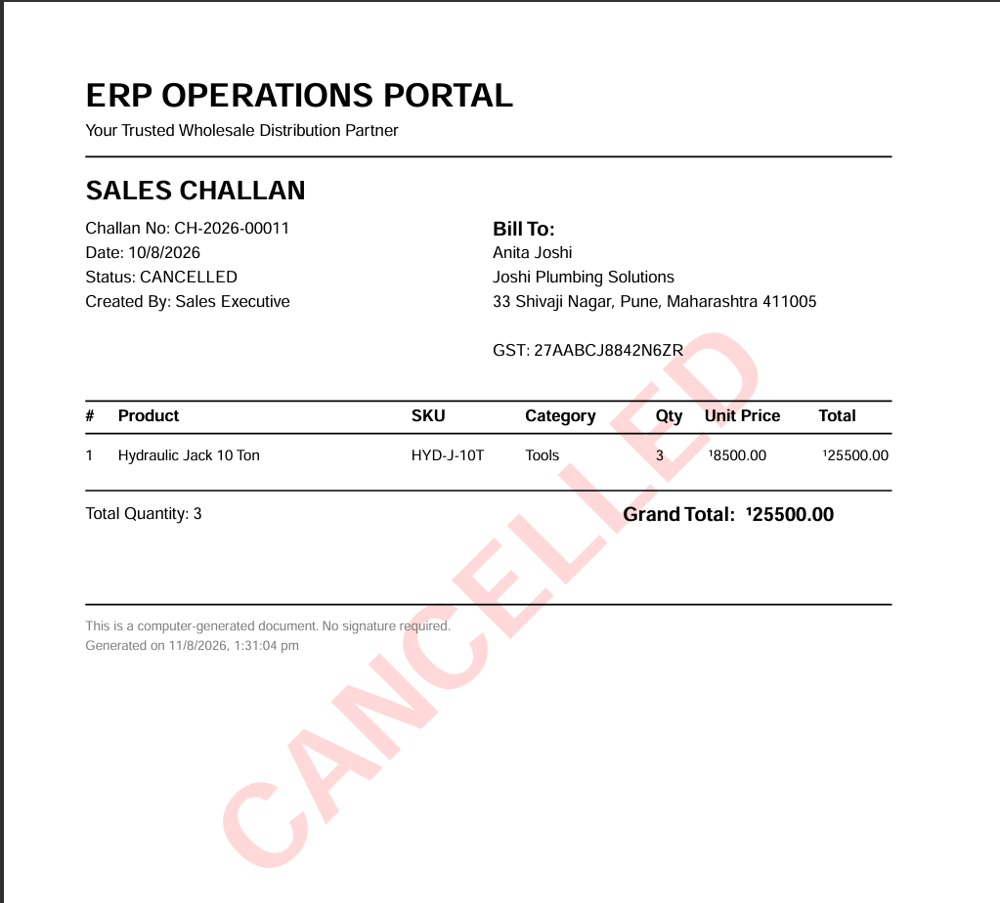 |

### 🏬 Warehouse Operations & Stock Adjustments
| Stock Movement Audit Log | Adjust Stock Manually Modal |
|:---:|:---:|
| 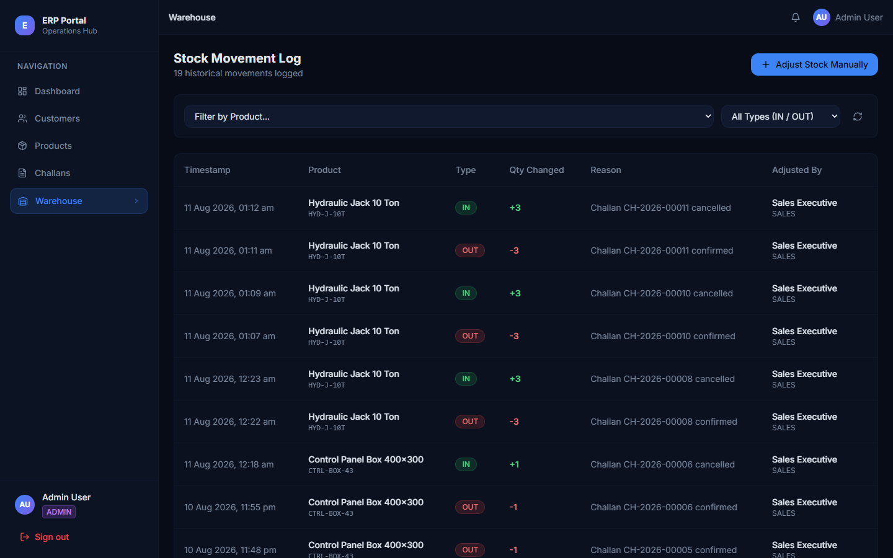 | 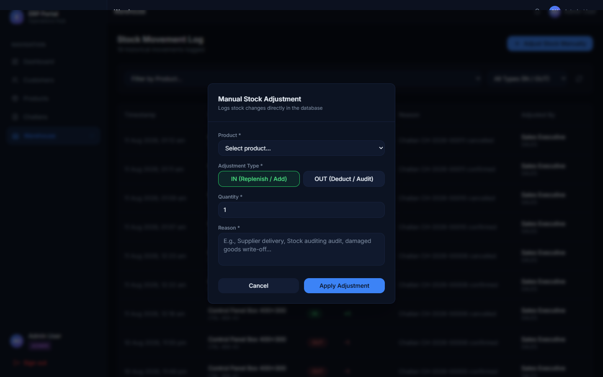 |

---


## 🏗 Architecture

```
┌─────────────────────────────────────────────────────────────┐
│                        Frontend (Vercel)                     │
│     React + TypeScript + Vite + Tailwind CSS + shadcn/ui    │
└───────────────────────────┬─────────────────────────────────┘
                            │ HTTPS / REST API
┌───────────────────────────▼─────────────────────────────────┐
│                        Backend (Render)                      │
│            Node.js + Express + TypeScript + Prisma           │
└───────────────────────────┬─────────────────────────────────┘
                            │ TLS / PostgreSQL
┌───────────────────────────▼─────────────────────────────────┐
│                    Database (Neon Postgres)                   │
│                  Serverless PostgreSQL (AWS us-west-2)       │
└─────────────────────────────────────────────────────────────┘
```

**Monorepo structure:**
```
/backend          Express + TypeScript + Prisma API
/frontend         React + TypeScript + Vite SPA
/.github/workflows  CI/CD GitHub Actions
/postman          Postman collection (exported)
README.md
```

---

## 🚀 Local Setup

### Option A: Standard Setup (Prerequisites: Node >= 20, npm >= 10, Postgres)
#### 1. Clone
```bash
git clone https://github.com/rk-005/erp-system.git
cd erp-system
```

#### 2. Backend Setup
```bash
cd backend
cp .env.example .env
# Edit .env with your database URL and JWT secret
npm install
npx prisma generate
npx prisma migrate dev
npx prisma db seed
npm run dev
# Backend runs on http://localhost:5000
```

#### 3. Frontend Setup
```bash
cd frontend
cp .env.example .env
# Edit .env: VITE_API_URL=http://localhost:5000/api
npm install
npm run dev
# Frontend runs on http://localhost:5173
```

---

### Option B: Docker Setup 🐳 (Bonus Achieved 100%)
Ensure you have Docker and Docker Compose installed. From the root directory, simply run:
```bash
docker-compose up --build
```
This single command spins up:
1. **PostgreSQL** database on port `5432`
2. **Backend API** container on port `5000`
3. **Frontend Nginx** static server container on port `80`

The system automatically initializes and configures environment connections.

---

## 🔑 Test Credentials

| Role | Email | Password |
|---|---|---|
| **ADMIN** | admin@erp.local | Admin@123 |
| **SALES** | sales@erp.local | Sales@123 |
| **WAREHOUSE** | warehouse@erp.local | Warehouse@123 |
| **ACCOUNTS** | accounts@erp.local | Accounts@123 |

> ⚠️ These are for submission/demo purposes only. Change in production.

---

## 🌍 Environment Variables

### Backend (`/backend/.env`)

| Variable | Required | Description |
|---|---|---|
| `DATABASE_URL` | ✅ | Neon/Postgres connection string |
| `JWT_SECRET` | ✅ | ≥ 32 char random secret for JWT signing |
| `JWT_EXPIRES_IN` | ✅ | Token expiry e.g. `2h` |
| `PORT` | ✅ | Server port (Render sets this automatically) |
| `NODE_ENV` | ✅ | `development` or `production` |
| `FRONTEND_URL` | ✅ | Frontend origin for CORS allowlist |
| `BCRYPT_ROUNDS` | optional | Bcrypt cost factor (default: 12) |

### Frontend (`/frontend/.env`)

| Variable | Required | Description |
|---|---|---|
| `VITE_API_URL` | ✅ | Backend API base URL (e.g. `https://your-app.onrender.com/api`) |

---

## 🛡 Role / Permission Matrix

| Action | ADMIN | SALES | WAREHOUSE | ACCOUNTS |
|---|:---:|:---:|:---:|:---:|
| Login | ✅ | ✅ | ✅ | ✅ |
| Dashboard (Personalized) | ✅ | ✅ | ✅ | ✅ |
| View customers | ✅ | ✅ | ❌ | ✅ |
| Create/edit customers | ✅ | ✅ | ❌ | ✅ *(Accounts can update info/billing)* |
| Add customer notes | ✅ | ✅ | ❌ | ✅ *(Accounts can add billing/credit notes)* |
| View products | ✅ | ✅ | ✅ | ✅ |
| Create/edit products | ✅ | ❌ | ✅ | ❌ |
| Adjust stock manually | ✅ | ❌ | ✅ | ❌ |
| View challans | ✅ | ✅ | ✅ | ✅ |
| Create challans | ✅ | ✅ | ❌ | ❌ |
| Confirm/cancel challans | ✅ | ✅ | ❌ | ❌ |
| View PDF Preview / Download | ✅ | ✅ | ✅ | ✅ |

> Backend enforces all permissions independently of frontend hiding.
> `401` = missing/invalid/expired token; `403` = valid token but wrong role.

---

## 📡 API Reference

Base URL: `http://localhost:5000/api` (dev) or your Render URL (prod)

### Authentication
All endpoints except `POST /auth/login` require `Authorization: Bearer <token>`.

| Method | Endpoint | Description |
|---|---|---|
| POST | `/auth/login` | Login → returns JWT |
| GET | `/auth/me` | Current user info |

### Customers
| Method | Endpoint | Roles | Description |
|---|---|---|---|
| GET | `/customers` | All (excl. WAREHOUSE) | List with search/filter/pagination |
| POST | `/customers` | ADMIN, SALES | Create customer |
| GET | `/customers/:id` | All (excl. WAREHOUSE) | Customer detail |
| PATCH | `/customers/:id` | ADMIN, SALES | Update customer |
| GET | `/customers/:id/notes` | All (excl. WAREHOUSE) | Get notes |
| POST | `/customers/:id/notes` | ADMIN, SALES | Add note |

### Products
| Method | Endpoint | Roles | Description |
|---|---|---|---|
| GET | `/products` | All | List with search/filter/pagination |
| POST | `/products` | ADMIN, WAREHOUSE | Create product |
| GET | `/products/low-stock` | All | Products at or below minStockAlert |
| GET | `/products/:id` | All | Product detail + stock movements |
| PATCH | `/products/:id` | ADMIN, WAREHOUSE | Update product |

### Stock Movements
| Method | Endpoint | Roles | Description |
|---|---|---|---|
| GET | `/stock-movements` | All | List with filter/pagination |
| POST | `/stock-movements` | ADMIN, WAREHOUSE | Manual stock adjustment |

### Challans
| Method | Endpoint | Roles | Description |
|---|---|---|---|
| GET | `/challans` | All | List with filter/pagination |
| POST | `/challans` | ADMIN, SALES | Create (as DRAFT or CONFIRMED) |
| GET | `/challans/:id` | All | Challan detail |
| PATCH | `/challans/:id` | ADMIN, SALES | Update DRAFT challan only |
| POST | `/challans/:id/confirm` | ADMIN, SALES | Confirm → atomic stock deduction |
| POST | `/challans/:id/cancel` | ADMIN, SALES | Cancel → stock restored if was CONFIRMED |
| GET | `/challans/:id/pdf` | All | Download PDF |

### Error Response Shape
```json
{
  "error": {
    "message": "Human-readable description",
    "code": "MACHINE_READABLE_CODE",
    "details": { }
  }
}
```

### Success Response Shape
```json
{
  "data": { },
  "pagination": { "total": 100, "page": 1, "limit": 20, "totalPages": 5 }
}
```

---

## ⚡ Challan Confirmation Logic (Critical)

When `POST /challans/:id/confirm` is called, a single `prisma.$transaction()` runs:

1. Fetches challan + all items inside the transaction
2. Validates challan is in `DRAFT` state
3. **Re-fetches current stock** for all products (never trusts stale data)
4. Checks **ALL** items — collects all failures before aborting
5. If ANY item fails → throws `409 Conflict` with full `insufficientItems[]` details → **no stock changes at all**
6. If ALL pass → decrements stock, creates `StockMovement` (OUT) per product, snapshots product data into `ChallanItem.productSnapshot`, sets challan to `CONFIRMED`

All 6 steps are atomic — either all succeed or none do.

---

## 🚀 Deployment

### Neon (Database)
Already provisioned. Run `npx prisma migrate dev` to apply schema changes.

### Render (Backend)
1. Connect GitHub repo → `backend/` as root directory
2. Build command: `npm install && npx prisma generate && npm run build`
3. Start command: `node dist/index.js`
4. Environment variables: copy from `backend/.env` (use real values)

### Vercel (Frontend)
1. Import GitHub repo → `frontend/` as root directory
2. Framework: Vite
3. Environment variable: `VITE_API_URL=https://your-render-backend.onrender.com/api`

### GitHub Actions Secrets
For CI/CD deployment triggers, set these in GitHub repo Settings → Secrets:
- `RENDER_DEPLOY_HOOK` — your Render deploy hook URL
- `VERCEL_DEPLOY_HOOK` — your Vercel deploy hook URL
- `DATABASE_URL` — (optional) for running migrations in CI

---

## 🧪 Running Tests

```bash
cd backend
npm test         # run Vitest suite
npm run test:watch   # watch mode
```

Test coverage includes:
- `challanService.test.ts` — Challan confirmation: success path, insufficient stock (single + multiple products), atomicity, empty challan, wrong state

---

## ⚠️ Known Limitations & Assumptions

1. **PDF auth**: PDF download currently uses a query param token workaround for browser `window.open`. In production, use a signed URL or proper fetch+blob approach.
2. **No product images**: Out of scope per spec fixings.
3. **No real-time stock updates**: Frontend does not auto-refresh if another user confirms a challan concurrently. Refresh manually.
4. **Search on mobile**: Search input debounce not implemented (immediate API calls on each keystroke). Add debounce for production.
5. **Challan items deletions**: When a product is deleted, `ChallanItem.productId` becomes `null` but the snapshot preserves all data correctly.
6. **No refresh tokens**: JWT 2h expiry redirects to login on expiry. Refresh token flow not implemented.
7. **WAREHOUSE role**: Cannot see Customers module (as per spec). If this needs adjustment, update `ROLES.CUSTOMER_READERS` in `role.ts`.

---

## 📚 API Documentation

Postman collection: see `/postman/` directory in this repo.

---

## 🏃 Quick Start Demo

```bash
# 1. Start backend
cd backend && npm run dev

# 2. Start frontend (new terminal)
cd frontend && npm run dev

# 3. Open http://localhost:5173
# 4. Login with: admin@erp.local / Admin@123
```
